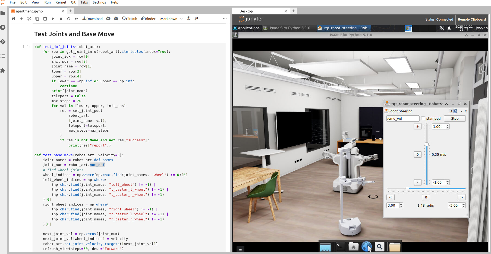
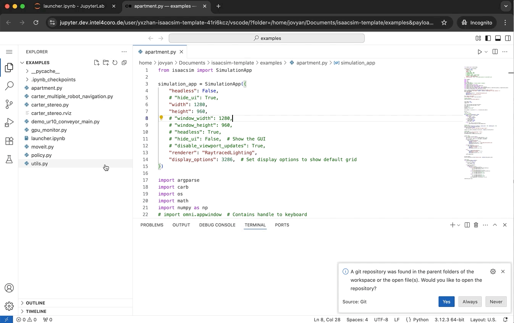
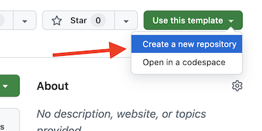

# isaacsim-template

[](https://binder.dev.intel4coro.de/v2/gh/yxzhan/isaacsim-template/main?urlpath=lab%2Ftree%2Fexamples%2Flauncher.ipynb)

This is a template repo for running modern robot simulator (such as Isaac Sim and Unreal Engine) on the GPU-enabled AIRCOR VRB cloud server.

https://github.com/user-attachments/assets/1b3cd8d2-048c-43c3-9e97-31fb69fb479b

> ### Access Requirements:
> 
> Currently, the GPU-enabled server is only accessible within the Uni-Bremen network. You need to be connected through one of the following:
>
> - Office LAN network
> - Eduroam Wifi in campus
> - University VPN (vpn.uni-bremen.de)

## Quick start

1. Open the following link in a new browser tab to launch a lab instance:

    https://binder.dev.intel4coro.de/v2/gh/yxzhan/isaacsim-template/main?urlpath=lab/tree/examples/launcher.ipynb

1. The notebook `launcher.ipynb` is a UI interface of [ipywidgets](https://github.com/jupyter-widgets/ipywidgets) for quickly running the demos. Follow the notebook instruction to initialize the UI. If you see the low memory warning message, it indicates that someone else is currently using the GPU resources. Please wait until it is free before trying again.

1. Since Isaac Sim only supports Python 3.11 while the default Python environment (aligned with ROS Jazzy) is version 3.12. To run Isaac Sim code within the notebook, you need to set the kernel to "Isaac Sim Python 3.11". In the same directory, there is an example notebook named [apartment.ipynb](./examples/apartment.ipynb), which provides a simple step-by-step  tutorial covering some fundamental usage scenarios.

    

1. Alternatively, you can open the code with `VSCode` and configuring the Python interpreter to `/isaac-sim/python.sh`.

    

1. If you are running programs that utilize GPU resources, such as Isaac Sim or Unreal Engine, please remember to manually terminate the processes afterward, as GPU resources are highly limited. Best to manually shut down the entire lab instance in menu `File > Shutdown`.

    

> Note: Currently, only Vulkan-based programs can utilize GPU rendering, while OpenGL-based applications (such as Rviz, PyBullet, Mujoco, Gazebo, etc.) are rendering by CPU.

## Upgrade existing VRB labs

The existing VRB labs can also run directly on the GPU server by simply changing the launch URL from "https://binder.XXX" to "https://binder.dev.XXX". However, to run Isaac Sim, the Docker image needs to be upgraded to at least Ubuntu 22.04 and requires the installation of a VNC desktop, the recommended way is to update the base Docker image to `intel4coro/jupyter-ros2:jazzy-py3.12`.

## Create a new VRB lab from this template

1. Login to Github.

1. Use this template repository to create a new repository or fork it. Forking will make it easier to sync with future updates.

    

1. Clone your git repo, add your notebooks, python code, USD files to the repo.

1. Modify the [binder/requirements.txt](binder/requirements.txt) to install additional python packages.

1. Modify the [binder/Dockerfile](binder/Dockerfile) if your project needs additional APT packages.

    Examples:

    ```Dockerfile
    # Install APT packages (switch to root user)
    USER root
    RUN apt update
    RUN apt install -y ffmpeg
    # Switch back to the non-root user to avoid file permission issues.
    USER ${NB_USER}
    ```

1. Launch your VRB lab instance, replacing the placeholder content inside the curly braces `{}` with your actual information, and open in web browser.

    ```
    https://binder.dev.intel4coro.de/v2/gh/{YOUR_GITHUB_USER_NAME}/{YOUR_REPO_NAME}/main?urlpath=lab/tree/{PATH_TO_NOTEBOOK}
    ```

    The first time it is launched, it will take some time to build the Docker image.

<!-- ## Repository Structure

```
.
├── binder/           # Defines the container environment
├── examples/         # Jupyter notebook and python examples
└── usd/              # Example USD file (iai_apartment)
```

## Lab Runtime Structure

The runtime environment can be divided into three layers:

- The top layer (GitHub repo) is fully controllable by users.
- The middle shared directory layer allows restricted user access.
- The bottom GPU toolkit layer can only be managed by the background cloud system.

 -->

## Local Development

### Install Docker and NVIDIA Container Toolkit

Docker: https://docs.docker.com/engine/install/

NVIDIA Container Toolkit: https://docs.nvidia.com/datacenter/cloud-native/container-toolkit/latest/install-guide.html

### Run and build docker image Locally (Under repo directory)

- Build and run docker image:

  ```bash
  sudo docker compose -f ./binder/docker-compose.yml up --build
  ```

- Open Web browser and go to http://localhost:8888/

- To stop and remove container:

  ```bash
  sudo docker compose -f ./binder/docker-compose.yml down
  ```
