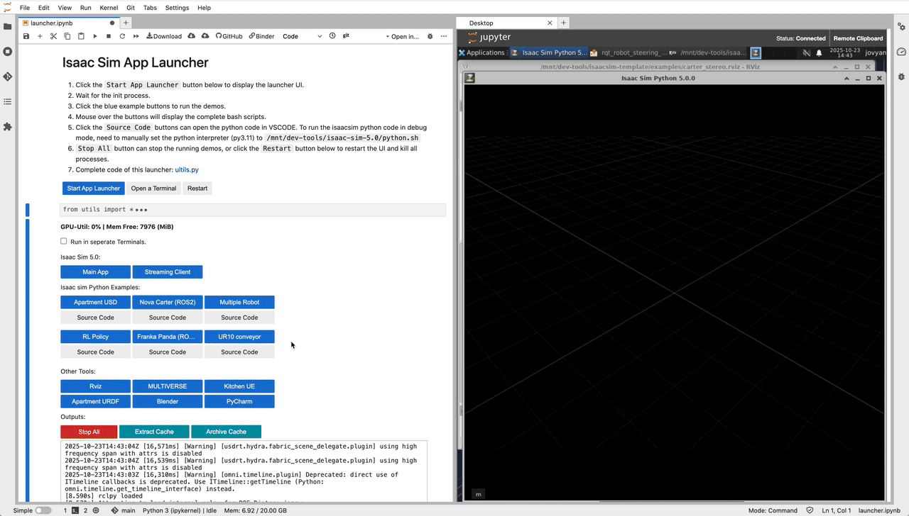
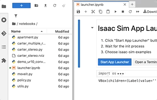
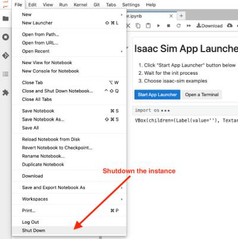
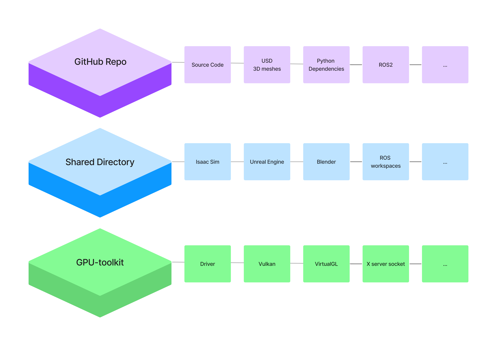

# isaacsim-template

[](https://binder.dev.intel4coro.de/v2/gh/yxzhan/isaacsim-template/main?urlpath=lab%2Ftree%2Fnotebooks%2Flauncher.ipynb)

This is a template repo for running modern robot simulator (such as Isaac Sim and Unreal Engine) on the GPU-enabled VRB cloud server.




> ### Access Requirements:
> 
> Currently, the GPU-enabled VRB is only accessible within the University of Bremen network. You must be connected through one of the following:
>
> - Office network
> - eduroam Wifi in campus
> - University VPN (vpn.uni-bremen.de)

## Quick start

1. Open the following link to launch a lab instance:

    https://binder.dev.intel4coro.de/v2/gh/yxzhan/isaacsim-template/main?urlpath=lab/tree/notebooks/launcher.ipynb

2. The opened Jupyter Notebook can run some demos and tools, and all official Isaac Sim Python standalone examples. Since Isaac Sim only supports Python 3.11 while the default Python environment (aligned with ROS Jazzy) is version 3.12, the example Python code cannot be directly executed in the notebook and requires additional environment variable configuration. The specific environment variables are defined in [examples/utils.py](./examples/utils.py). Alternatively, you can opened the code with `VSCode` or `PyCharm` and manually configuring the Python interpreter to `/mnt/dev-tools/isaac-sim-5.0/python.sh`.

3. Navigate to the parent directory in the file browser, and you will see a folder named `dev-tools`(a symlink to the shared storage space `/mnt/dev-tools`), which contains the Isaac Sim main program, precompiled shader caches, and other large files.

    

4. You can store files under the dev-tools directory (please create a new subdirectory). This allows others to directly access your files (e.g., USD assets, ROS workspaces) without building new docker images. Files outside this directory will be deleted when the current container is terminated. To upload local files, simply drag and drop them into the file browser.

5. If you are running programs that utilize GPU resources, such as Isaac Sim or Unreal Engine, please remember to manually terminate the processes afterward, as GPU resources are highly limited. Best to manually shut down the entire lab instance in menu `File > Shutdown`.

    

6. Currently, only Vulkan-based programs can utilize GPU rendering, while OpenGL-based applications (such as Rviz, PyBullet, Mujoco, Gazebo, etc.) are still rendering by CPU.

## Upgrade existing VRB labs

The existing VRB labs can also run directly on the GPU server by simply changing the launcher URL from "https://binder.XXX" to "https://binder.dev.XXX". However, to run Isaac Sim, the Docker image needs to be upgraded to at least Ubuntu 22.04 and requires the installation of a VNC desktop, the recommended way is to update the base Docker image to `intel4coro/jupyter-ros2:jazzy-py3.12`.

## Create a new repository from this template

1. Create your own repository using this template repo. Detail steps can be found in: https://vib.ai.uni-bremen.de/page/softwaretools/cloud-based-robotics-platform#zero-to-binder

1. Place your own notebooks, python code, usd files in the repo.

1. Customize the [Dockerfile](binder/Dockerfile) if your project needs additional Python packages or system libraries.

1. Launch your VRB repo to build docker image.

1. Run your custom simulation workflows.

## Repository Structure

```
.
├── binder/           # Defines the container environment
├── examples/         # Jupyter notebook and Isaacsim examples
└── usd/              # Example USD file (iai_apartment)
```

## Lab Runtime Structure

The runtime environment can be divided into three layers:

- The top layer (GitHub repo) is fully controllable by users.
- The middle shared directory layer allows restricted user access.
- The bottom GPU toolkit layer can only be managed by the background cloud system.



## Local Development

### Install Docker and NVIDIA Container Toolkit

Docker: https://docs.docker.com/engine/install/

NVIDIA Container Toolkit: https://docs.nvidia.com/datacenter/cloud-native/container-toolkit/latest/install-guide.html

### Run and build docker image Locally (Under repo directory)

- Download isaac-sim: https://docs.isaacsim.omniverse.nvidia.com/5.0.0/installation/download.html

- Create directories `dev-tools` under the repo directory:

  ```bash
  mkdir -p dev-tools
  ```
- Extract the Isaac Sim to directory `dev-tools`, rename it to `isaac-sim-5.0`.

- To make the current directory writable inside the container:

  ```bash
  sudo chmod -R g+w ./
  ```

- Build and run docker image:

  ```bash
  export GID=$(id -g) && \
  xhost +local:docker && \
  docker compose -f ./binder/docker-compose.yml up --build
  ```

- Open Web browser and go to http://localhost:8888/

- To stop and remove container:

  ```bash
  docker compose -f ./binder/docker-compose.yml down
  ```
